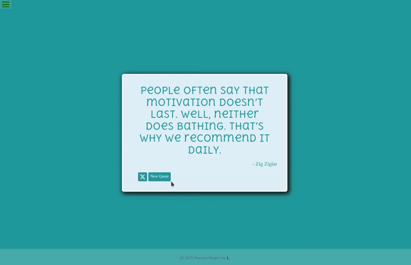
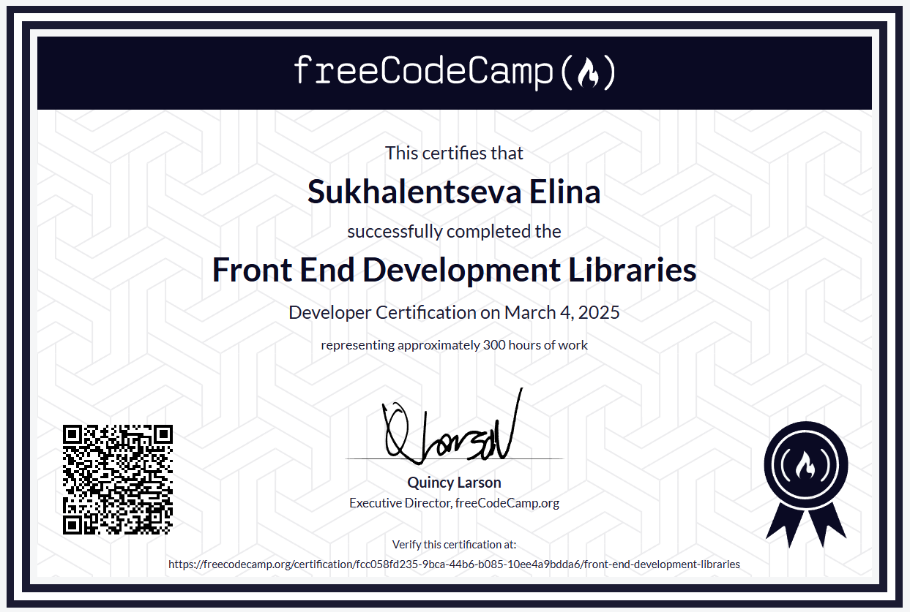

# Random Quote Machine

An old project built in the first half of 2025 as the start of my journey and posted here to attach to the course's page and to preserve my path.

This project is a part of FreeCodeCamp's Front End Development Libraries Certification. The goal is to build a **Random Quote Machine** that fetches a random quote from the API and displays it on the page while changing background as well.

## 📋 Project Requirements

This project fulfills all **11 user stories** from FreeCodeCamp's "Build a Random Quote Machine" challenge:

<b>Click to expand the full requirements</b>

 

**User Stories:**
- [x] Wrapper element with `id="quote-box"`
- [x] Element with `id="text"` inside `#quote-box` (quote text)
- [x] Element with `id="author"` inside `#quote-box` (quote author)
- [x] Clickable element with `id="new-quote"` inside `#quote-box`
- [x] Clickable `<a>` element with `id="tweet-quote"` inside `#quote-box`
- [x] On first load, displays a random quote in `#text`
- [x] On first load, displays the quote's author in `#author`
- [x] Clicking `#new-quote` fetches and displays a new quote
- [x] Clicking `#new-quote` fetches and displays the new author
- [x] `#tweet-quote` links to `twitter.com/intent/tweet` with current quote
- [x] `#quote-box` wrapper is horizontally centered

**All tests passed** ✅

## 🎨 About the Project

### Technologies Used
- **Frontend:** React, Vite, CSS
- **Build Tool:** Vite
- **Deployment:** GitHub Pages

| Random Quote Machine Preview |
|---|
|  |

<i>submitted to FreeCodeCamp on Jan 25, 2025</i>

---

## 🔗 Live Demo

---
*First project of my [FreeCodeCamp Front End Libraries Certificate](https://www.freecodecamp.org/certification/fcc058fd235-9bca-44b6-b085-10ee4a9bdda6/front-end-development-libraries) journey*

